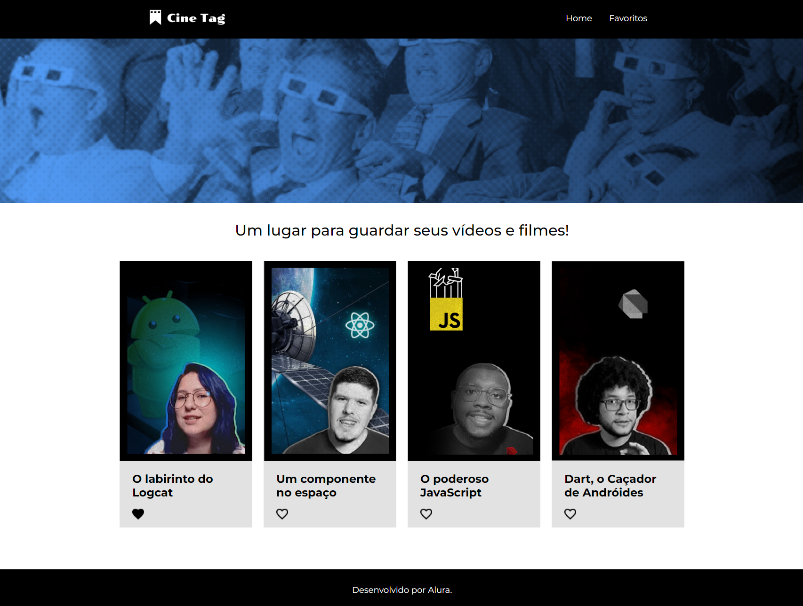

# 🎬 CineTag

Aplicação desenvolvida em **React (JSX)** durante o curso da [Alura](https://www.alura.com.br).  
Permite cadastrar vídeos com título, link e categoria personalizada, simulando um catálogo por tags.


---

## 📸 Preview

> ⚠️ Adicione aqui um print do projeto ou um GIF curto do uso da interface.  
> ## 📸 Preview




---

## 🚀 Tecnologias utilizadas

- React.js (JSX)
- JavaScript
- Styled Components
- React Router DOM
- Create React App

---

## ⚙️ Como rodar o projeto

```bash
# Clone o repositório
git clone https://github.com/Landim013/cinetag.git
cd cinetag

# Instale as dependências
npm install

# Inicie o projeto
npm start
